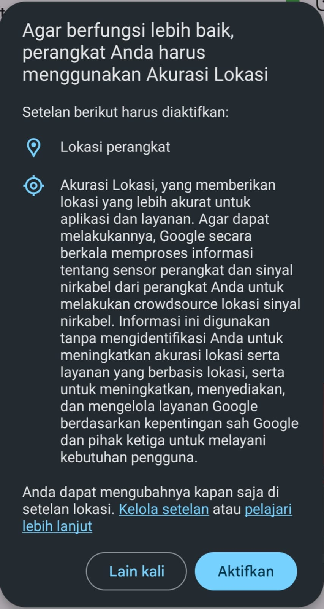

# LocationServiceHelper

`LocationServiceHelper` adalah helper yang menampilkan dialog native GPS enable **di dalam app** tanpa mengarahkan user ke halaman Settings. Di Android, dialog ini berasal dari Google Play Services (`SettingsClient.checkLocationSettings`). Di iOS tidak ada API setara — helper langsung mengembalikan status `CLLocationManager.locationServicesEnabled()` tanpa dialog.

Helper ini tidak menggantikan `geolocator` — ia hanya menangani satu hal: meminta user menyalakan GPS via dialog native sebelum operasi lokasi dilanjutkan. Integrasi ke `LocationService._guard()` sudah dilakukan sehingga caller tidak perlu memanggil helper ini secara langsung.

**Tampilan dialog di Android:**



---

## Struktur file

```
lib/core/services/location/
├── location_service.dart         # Service utama — sudah terintegrasi dengan helper
└── location_service_helper.dart  # Helper MethodChannel GPS dialog

android/app/src/main/kotlin/com/example/template_app/
└── MainActivity.kt               # Handler Kotlin: SettingsClient + onActivityResult

ios/Runner/
└── AppDelegate.swift             # Handler Swift: CLLocationManager.locationServicesEnabled()
```

---

## Cara kerja

```
Dart: LocationService._guard()
  └── isLocationServiceEnabled() → false
        └── LocationServiceHelper.requestService()
              └── MethodChannel("template_app/location_service").invokeMethod("requestService")
                    ├── Android: SettingsClient.checkLocationSettings()
                    │     ├── sukses → return true
                    │     ├── RESOLUTION_REQUIRED → startResolutionForResult() → dialog native
                    │     │     └── onActivityResult → return RESULT_OK ? true : false
                    │     └── error lain → return false
                    └── iOS: CLLocationManager.locationServicesEnabled() → return true/false
```

---

## Setup (salin ke project baru)

### 1. Salin file Dart

```
lib/core/services/location/location_service_helper.dart
```

Tidak ada dependency tambahan di `pubspec.yaml`. `geolocator` sudah menarik `com.google.android.gms:play-services-location` secara transitif.

### 2. Ganti nama channel (wajib)

Channel name saat ini adalah `template_app/location_service`. Ganti `template_app` sesuai nama package project:

**Dart** — [lib/core/services/location/location_service_helper.dart](../lib/core/services/location/location_service_helper.dart):

```dart
static const MethodChannel _channel = MethodChannel(
  'nama_project_baru/location_service', // ← ganti ini
);
```

**Kotlin** — `MainActivity.kt`:

```kotlin
const val CHANNEL = "nama_project_baru/location_service" // ← ganti ini
```

**Swift** — `AppDelegate.swift`:

```swift
let channel = FlutterMethodChannel(
  name: "nama_project_baru/location_service", // ← ganti ini
  ...
)
```

Ketiga string **harus identik**. Satu berbeda = channel tidak terhubung dan `MissingPluginException` terlempar (ditangkap, return `false`).

### 3. Android — tambahkan ke `MainActivity.kt`

Salin seluruh isi `MainActivity.kt`. Jika project sudah punya `MainActivity.kt` yang tidak kosong, lihat bagian [Konflik dengan plugin lain](#konflik-dengan-plugin-lain) di bawah.

Pastikan package declaration di baris pertama sesuai package name project:

```kotlin
package com.nama_company.nama_project // ← sesuaikan
```

### 4. iOS — tambahkan ke `AppDelegate.swift`

Salin blok registrasi channel (bukan seluruh file) ke dalam `application(_:didFinishLaunchingWithOptions:)`, **setelah** `GeneratedPluginRegistrant.register(with: self)`:

```swift
import CoreLocation // ← tambahkan import ini di atas file

// Setelah GeneratedPluginRegistrant.register(with: self):
if let controller = window?.rootViewController as? FlutterViewController {
  let channel = FlutterMethodChannel(
    name: "nama_project_baru/location_service",
    binaryMessenger: controller.binaryMessenger
  )
  channel.setMethodCallHandler { (call, result) in
    switch call.method {
    case "requestService":
      DispatchQueue.global(qos: .userInitiated).async {
        let enabled = CLLocationManager.locationServicesEnabled()
        DispatchQueue.main.async { result(enabled) }
      }
    default:
      result(FlutterMethodNotImplemented)
    }
  }
}
```

### 5. Daftarkan ke GetIt

```dart
// lib/core/injection/locator.dart
sl.registerLazySingleton(() => LocationServiceHelper());
sl.registerLazySingleton(() => LocationService(sl(), sl())); // CacheManager, LocationServiceHelper
```

---

## Penggunaan

### Via `LocationService` (cara yang benar)

Dialog GPS sudah dipicu otomatis dari `_guard()` di dalam `LocationService`. Caller tidak perlu tahu tentang helper:

```dart
final result = await locationService.getCurrentPosition();
result.fold(
  onSuccess: (position) { /* GPS aktif, posisi tersedia */ },
  onFailure: (error) {
    if (error.code == LOCATION_SERVICE_DISABLED_ERROR_CODE) {
      // User menolak dialog atau GPS masih mati setelah dialog
    }
  },
);
```

### Via helper langsung (jarang diperlukan)

Hanya gunakan ini jika perlu memicu dialog GPS di luar alur `LocationService`, misalnya saat onboarding:

```dart
final helper = sl<LocationServiceHelper>();
final enabled = await helper.requestService();
if (enabled) {
  // Lanjutkan operasi yang memerlukan GPS
}
```

---

## Best practice

- **Panggil setelah izin lokasi diberikan.** Dialog GPS hanya relevan jika permission sudah granted. Urutan yang benar: cek permission → minta permission → baru tampilkan dialog GPS. `LocationService._guard()` sudah mengikuti urutan ini.
- **Jangan panggil berulang dalam loop.** Satu panggilan `requestService()` sudah menunggu respons user (dialog ditutup). Tidak ada retry otomatis — keputusan ada di tangan user.
- **Tangani `false` dengan pesan yang jelas.** Ketika helper return `false`, GPS masih mati. Tampilkan pesan yang membantu user — `LocationService` sudah menyiapkan `AppError` dengan pesan dalam Bahasa Indonesia.
- **Jangan simpan hasil ke cache.** Status GPS bisa berubah kapan saja oleh user atau sistem. Selalu panggil ulang saat diperlukan.

---

## Aturan

### Yang harus dilakukan

- Ganti nama channel sesuai package name project sebelum digunakan.
- Daftarkan `LocationServiceHelper` ke GetIt dan inject melalui konstruktor `LocationService`.
- Tambahkan `import CoreLocation` di `AppDelegate.swift` jika belum ada.
- Panggil `super.onActivityResult(...)` di Android untuk request code yang bukan milik helper (sudah ada di implementasi).

### Yang tidak boleh dilakukan

- **Jangan panggil `requestService()` berkali-kali secara bersamaan.** Android menolak dengan `PlatformException(ALREADY_PENDING)` — helper mengembalikan `false` dan log error. Pastikan UI tidak bisa memicu dua panggilan sekaligus (disable tombol saat proses berlangsung).
- **Jangan gunakan `ActivityCompat.startActivityForResult()`** sebagai pengganti `startResolutionForResult()`. Dialog Play Services hanya bisa dipicu lewat `ResolvableApiException.startResolutionForResult()`.
- **Jangan hardcode request code `0xC0FE`.** Nilai ini sudah dipilih agar tidak bentrok dengan request code umum. Jika project lain menggunakan nilai yang sama, ubah ke nilai lain (lihat bagian konflik di bawah).
- **Jangan hapus `super.onActivityResult()`** pada request code yang bukan `REQUEST_CHECK_SETTINGS`. Plugin Flutter lain (image picker, file picker, dll.) mengandalkan `onActivityResult` dari Activity.
- **Jangan panggil helper sebelum `GeneratedPluginRegistrant.register(with: self)`** selesai di iOS — channel belum tersedia.

---

## Batasan

| Batasan                                      | Keterangan                                                                                                                                                                                                                                                                                 |
| -------------------------------------------- | ------------------------------------------------------------------------------------------------------------------------------------------------------------------------------------------------------------------------------------------------------------------------------------------ |
| **Android saja yang punya dialog native**    | iOS tidak memiliki API setara. Di iOS helper hanya mengecek status GPS tanpa interaksi user.                                                                                                                                                                                               |
| **Bergantung pada Google Play Services**     | Dialog tidak muncul di device tanpa Play Services (beberapa ROM custom, emulator tertentu, atau device non-Google). Helper return `false` dengan tenang.                                                                                                                                   |
| **Satu permintaan dalam satu waktu**         | Tidak bisa memanggil `requestService()` paralel — Android menolak dengan `ALREADY_PENDING`.                                                                                                                                                                                                |
| **Tidak bisa override teks dialog**          | Teks dan tombol dialog sepenuhnya dikontrol oleh Play Services — tidak bisa dikustomisasi.                                                                                                                                                                                                 |
| **`onActivityResult` deprecated di API 29+** | Google menandai `onActivityResult` deprecated dan merekomendasikan `ActivityResultLauncher`. Namun Flutter Engine masih merutekan hasil ke `onActivityResult` — selama Engine belum bermigrasi, implementasi ini tetap benar. Pantau changelog Flutter Engine jika muncul breaking change. |
| **iOS: tidak ada dialog**                    | Satu-satunya cara meminta user menyalakan GPS di iOS adalah dengan deep link ke Settings: `UIApplication.openSettingsURLString`. Ini di luar scope helper ini.                                                                                                                             |

---

## Konflik dengan plugin lain

### Konflik `onActivityResult` (Android)

Plugin Flutter seperti `image_picker`, `file_picker`, dan `permission_handler` juga mengandalkan `onActivityResult`. Implementasi saat ini sudah aman karena selalu memanggil `super.onActivityResult()` untuk request code yang bukan milik helper:

```kotlin
override fun onActivityResult(requestCode: Int, resultCode: Int, data: Intent?) {
    if (requestCode == REQUEST_CHECK_SETTINGS) {
        pendingResult?.success(resultCode == Activity.RESULT_OK)
        pendingResult = null
        return // tidak perlu teruskan ke super untuk request ini
    }
    super.onActivityResult(requestCode, resultCode, data) // plugin lain tetap menerima hasil
}
```

Jika ada plugin yang menggunakan request code `0xC0FE` (49406), ganti konstanta:

```kotlin
const val REQUEST_CHECK_SETTINGS = 0xBEEF // pilih nilai lain yang unik
```

### Konflik channel name

Jika ada plugin pihak ketiga yang kebetulan mendaftarkan channel `template_app/location_service` (sangat tidak mungkin namun bisa), ganti nama channel di ketiga tempat (Dart, Kotlin, Swift) menjadi nama yang lebih spesifik:

```
com.nama_company.nama_project/location_service
```

### `MainActivity` sudah dimodifikasi plugin lain

Beberapa plugin (terutama plugin notifikasi atau maps tertentu) mewajibkan `MainActivity` mewarisi class selain `FlutterActivity`, misalnya `FlutterFragmentActivity`. Dalam kasus ini:

1. Ganti `FlutterActivity` dengan class yang diwajibkan plugin tersebut.
2. Pastikan class tersebut masih meng-override `onActivityResult` — umumnya sudah tersedia.
3. Tambahkan logika `configureFlutterEngine` dan `onActivityResult` dari helper ke dalam class yang sudah ada.

Contoh dengan `FlutterFragmentActivity`:

```kotlin
import io.flutter.embedding.android.FlutterFragmentActivity // ← ganti import

class MainActivity : FlutterFragmentActivity() { // ← ganti parent class
    // Sisa implementasi sama persis
}
```

### `AppDelegate` sudah dimodifikasi plugin lain

Jika `AppDelegate.swift` sudah memiliki logika dari plugin lain (seperti `flutter_local_notifications` yang sudah ada di template ini), cukup **tambahkan** blok channel setelah `GeneratedPluginRegistrant.register(with: self)`. Jangan timpa `AppDelegate` — selalu append, bukan replace.

Urutan yang aman:

```swift
GeneratedPluginRegistrant.register(with: self) // ← harus sebelum channel setup

// Blok channel LocationServiceHelper:
if let controller = window?.rootViewController as? FlutterViewController {
  // ...
}

return super.application(application, didFinishLaunchingWithOptions: launchOptions)
```

### Konflik dengan `geolocator` atau plugin lokasi lain

`geolocator` dan plugin lokasi lain tidak mendaftarkan channel dengan nama yang sama, sehingga tidak ada konflik channel. Namun jika project menggunakan plugin lokasi lain yang **juga** mencoba menampilkan dialog GPS (misalnya `flutter_background_geolocation`), pastikan tidak ada dua panggilan dialog GPS yang aktif bersamaan — hasilnya tidak deterministik dari sisi user experience.
